# Анализ запросов

## 1
### без индексов
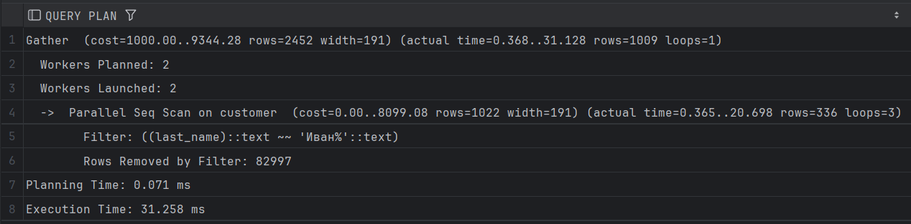
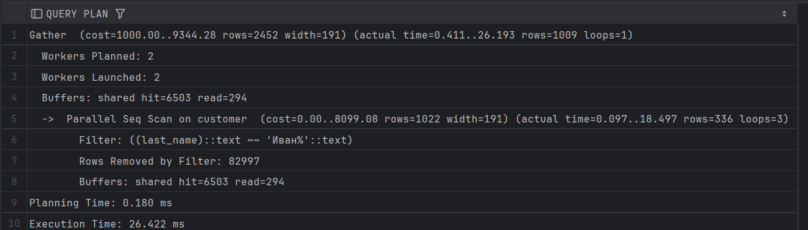
### с индексами
#### btree
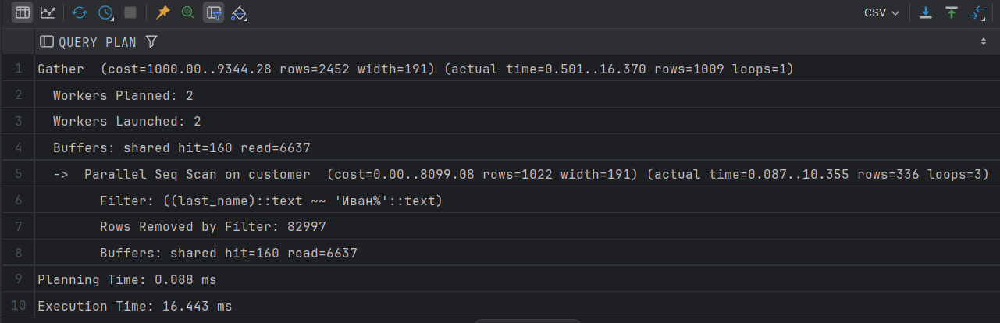
#### hash
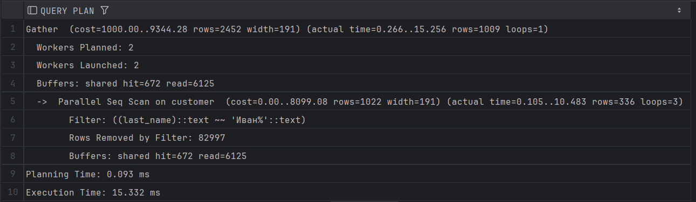
### Вывод
при использовании Like% индексы не используются

## 2
### без индексов
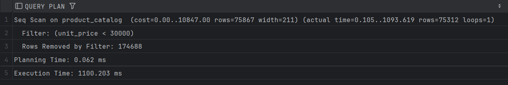
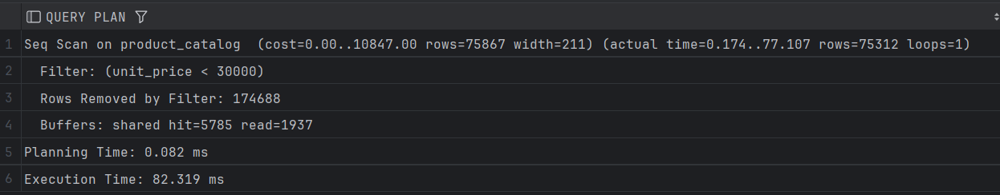
### с индексами
#### btree
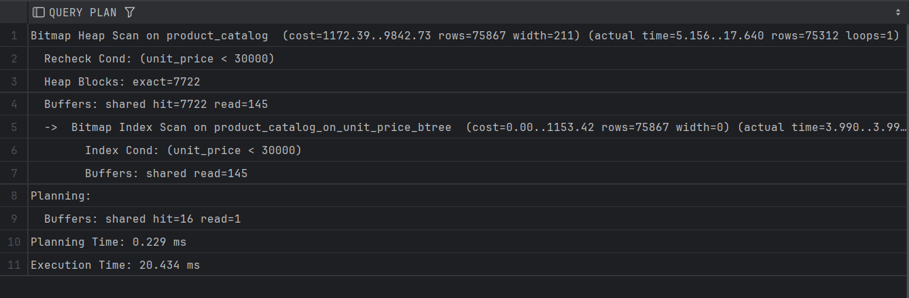
#### hash
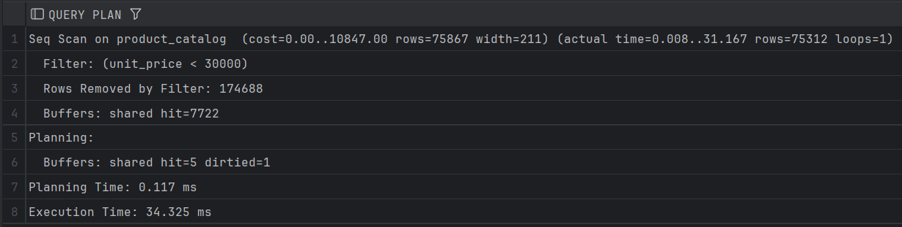
### Вывод
hash скан работает медленнее чем btree при использовании интерваьлных условий (<, >)

## 3
### без индексов
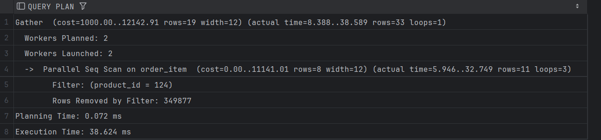
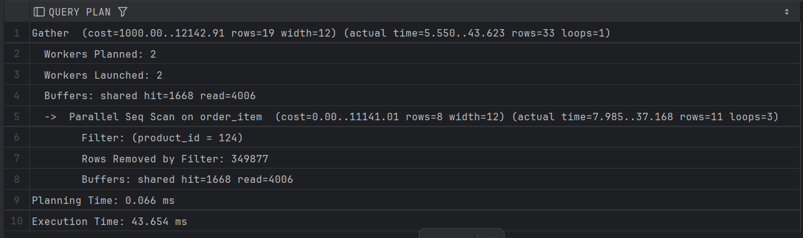
### с индексами
#### btree
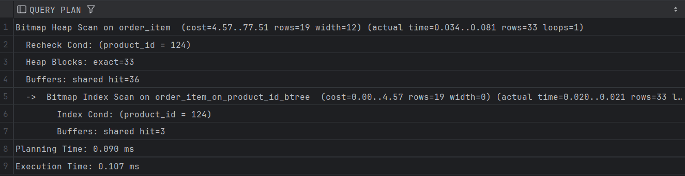
#### hash
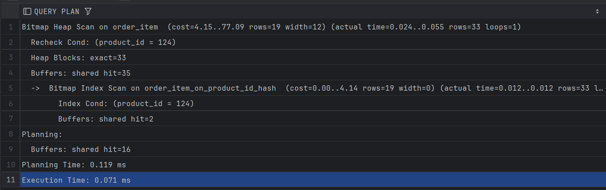
### Вывод
hash скан работает быстрее чем btree при условии равенства

## 4
### без индексов
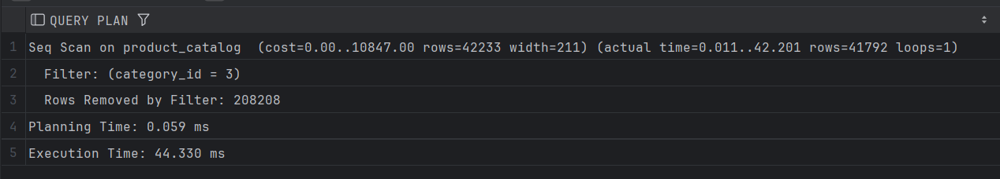
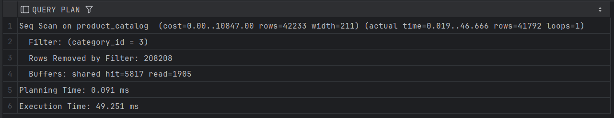
### с индексами
#### btree
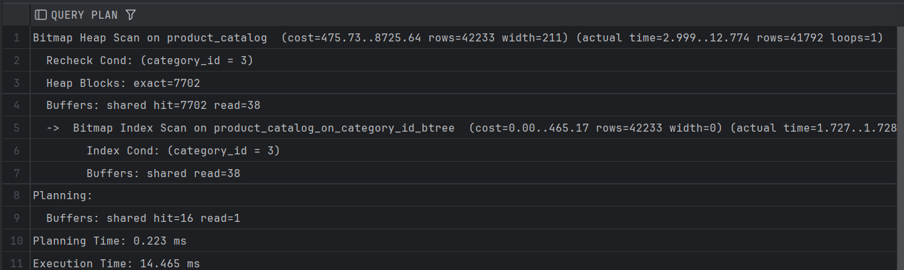
#### hash
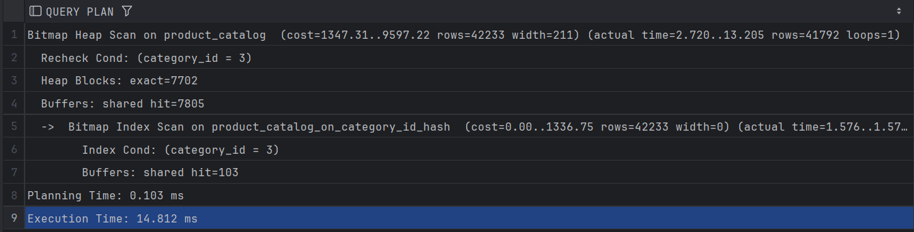
### Вывод
предполагаемое время было меньше у варианта с hash, однако в реальности время почти не отливается, помимо этого, при существовании обоих индексов, ввыбирался почему-то btree

## 5
### без индексов
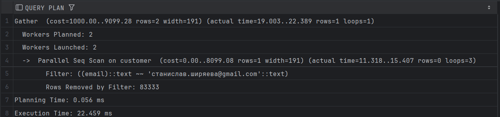
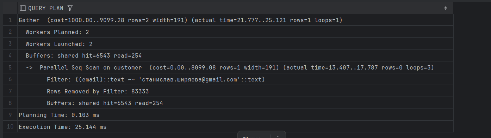
### с индексами
#### btree
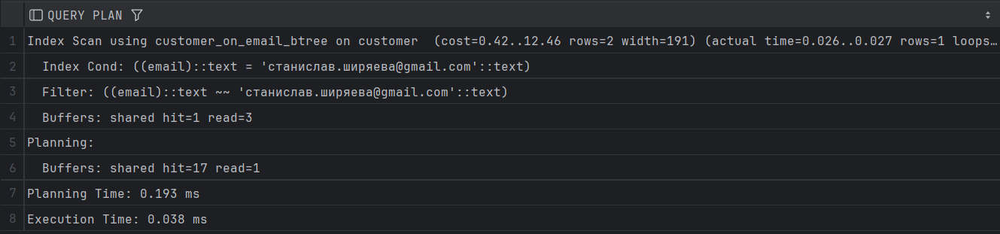
#### hash
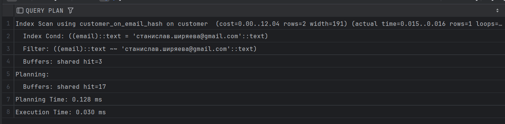
### Вывод
если с помощью like искать конкретную строку, то индексы работают. При этом hash работает быстрее и выбирается преимущественно, перед btree
