# Анализ запросов

# Gin

## 1
### без индекса
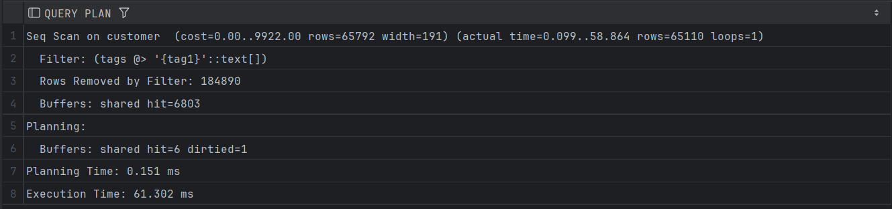

### с индексом
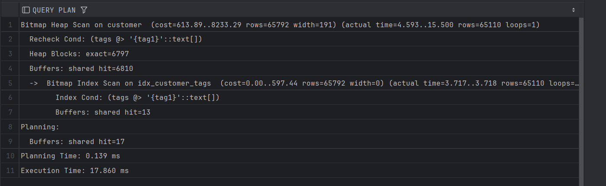

## 2
### без индекса
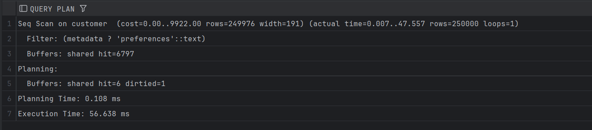

### с индексом
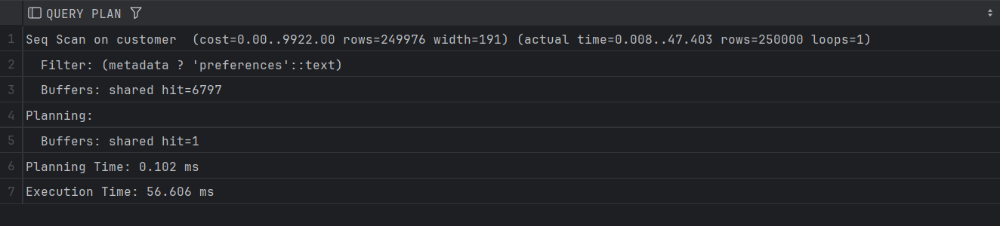

#### Замечание
Даже с индексом используется Seq scan, потому что столбец по которому работает индекс всегда имеет значение из условия.
для следующего варианта данные были изменены запросом из файла sem2/db/seed/adjust_metadata.sql 
## 3
### без индекса
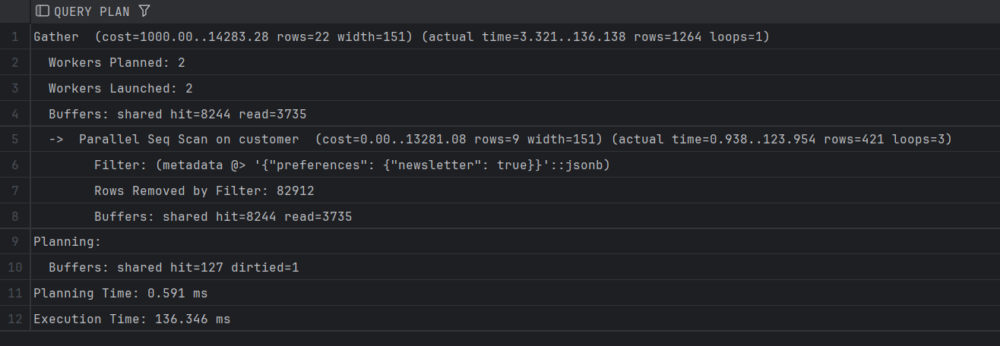

### с индексом
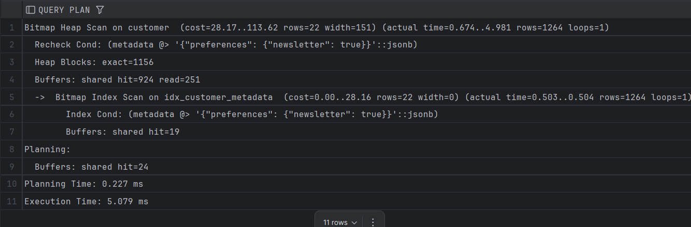
#### Замечание
после исправления данных на данные с большей селективностью, индекс уже используется планировщиком
## 4
### без индекса
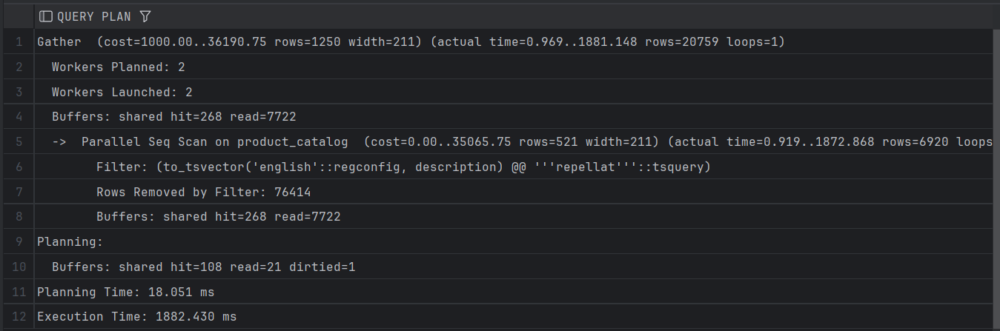

### с индексом
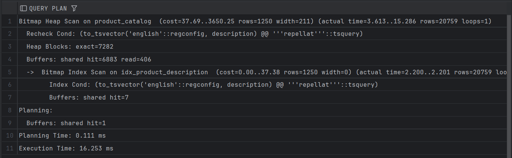


## 5
### без индекса
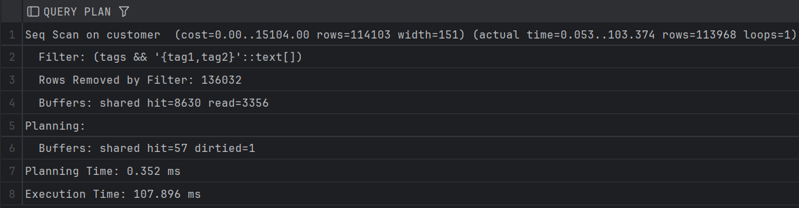

### с индексом
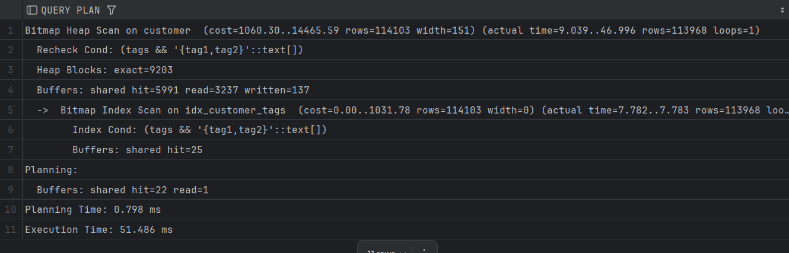

# GIST

## 1
### без индекса
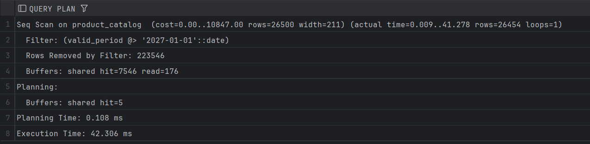
### с индексом
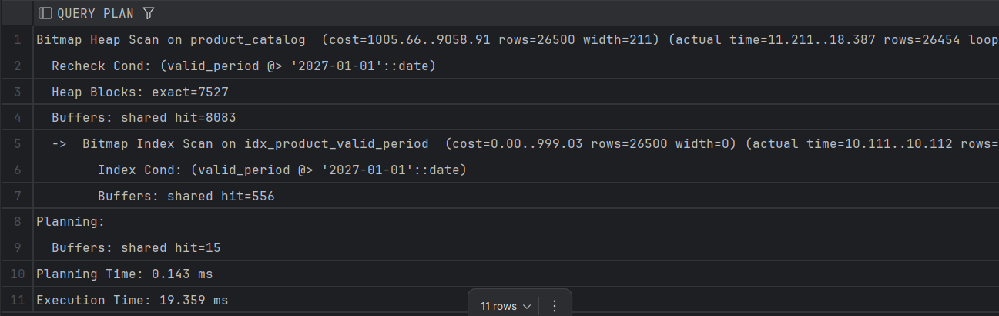
#### Замечание
нужно выделять крайнюю дату из существующих, иначе в запрос попадает слишком много строк, и индекс не работает
## 2
### без индекса
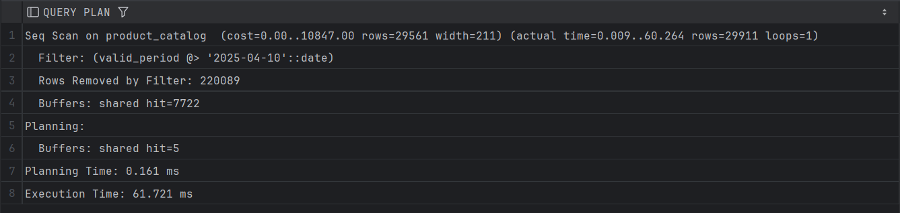
### с индексом
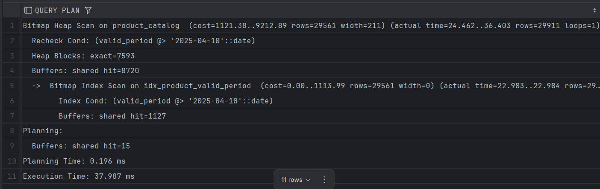
## 3
### без индекса
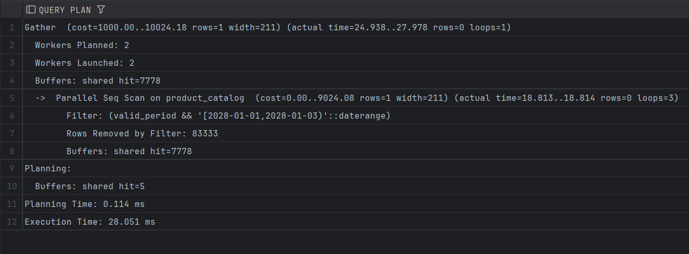
### с индексом
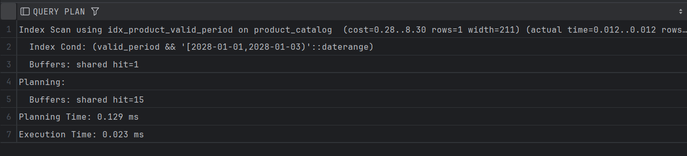
## 4
### без индекса
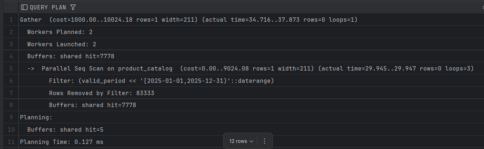
### с индексом
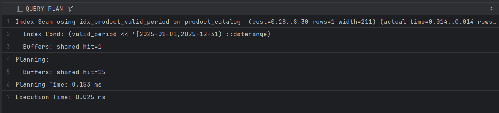
## 5
### без индекса
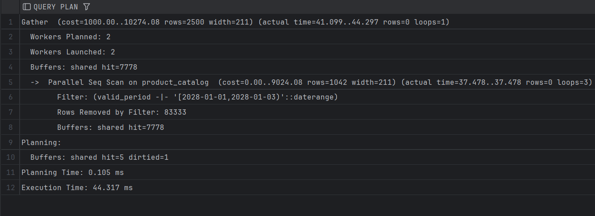

### с индексом
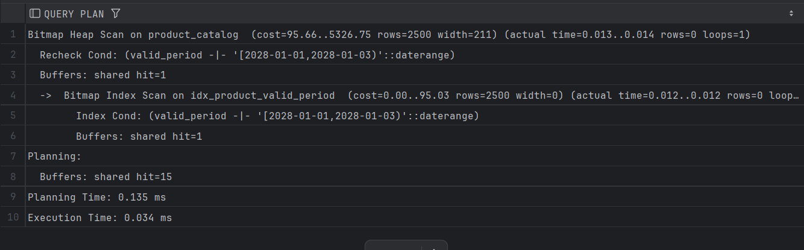

# JOIN

## 1

```
Limit  (cost=80584.74..80603.38 rows=100 width=53) (actual time=330.914..346.300 rows=100 loops=1)
"  Buffers: shared hit=4963 read=5258, temp read=6973 written=10086"
->  GroupAggregate  (cost=80584.74..276228.50 rows=1049665 width=53) (actual time=330.912..346.289 rows=100 loops=1)
"        Group Key: o.id, c.id"
"        Buffers: shared hit=4963 read=5258, temp read=6973 written=10086"
->  Nested Loop  (cost=80584.74..257859.37 rows=1049665 width=49) (actual time=330.891..346.233 rows=211 loops=1)
"              Buffers: shared hit=4963 read=5258, temp read=6973 written=10086"
->  Gather Merge  (cost=80584.31..202835.09 rows=1049665 width=20) (actual time=330.857..345.789 rows=211 loops=1)
Workers Planned: 2
Workers Launched: 2
"                    Buffers: shared hit=4563 read=5258, temp read=6973 written=10086"
->  Sort  (cost=79584.28..80677.68 rows=437360 width=20) (actual time=298.218..298.331 rows=928 loops=3)
"                          Sort Key: o.id, o.customer_id"
Sort Method: external merge  Disk: 10912kB
"                          Buffers: shared hit=4563 read=5258, temp read=6973 written=10086"
Worker 0:  Sort Method: external merge  Disk: 10872kB
Worker 1:  Sort Method: external merge  Disk: 13288kB
->  Parallel Hash Left Join  (cost=17223.60..29636.52 rows=437360 width=20) (actual time=141.726..210.594 rows=349888 loops=3)
Hash Cond: (o.id = oi.order_id)
"                                Buffers: shared hit=4491 read=5258, temp read=5600 written=5680"
->  Parallel Seq Scan on customer_order o  (cost=0.00..6064.33 rows=208333 width=16) (actual time=0.013..14.437 rows=166667 loops=3)
Buffers: shared hit=3981
->  Parallel Hash  (cost=10047.60..10047.60 rows=437360 width=8) (actual time=83.207..83.217 rows=349888 loops=3)
Buckets: 262144  Batches: 8  Memory Usage: 7232kB
"                                      Buffers: shared hit=416 read=5258, temp written=3180"
->  Parallel Seq Scan on order_item oi  (cost=0.00..10047.60 rows=437360 width=8) (actual time=0.088..30.115 rows=349888 loops=3)
Buffers: shared hit=416 read=5258
->  Memoize  (cost=0.43..0.55 rows=1 width=33) (actual time=0.002..0.002 rows=1 loops=211)
Cache Key: o.customer_id
Cache Mode: logical
Hits: 111  Misses: 100  Evictions: 0  Overflows: 0  Memory Usage: 14kB
Buffers: shared hit=400
->  Index Scan using customer_pkey on customer c  (cost=0.42..0.54 rows=1 width=33) (actual time=0.003..0.003 rows=1 loops=100)
Index Cond: (id = o.customer_id)
Buffers: shared hit=400
Planning:
Buffers: shared hit=19
Planning Time: 0.260 ms
Execution Time: 348.499 ms
```

## 2
```
Gather  (cost=9668.50..29286.51 rows=1 width=151) (actual time=95.451..358.602 rows=115497 loops=1)
  Workers Planned: 2
  Workers Launched: 2
  Buffers: shared hit=6062 read=10050
  ->  Parallel Hash Left Join  (cost=8668.50..28286.41 rows=1 width=151) (actual time=71.715..322.352 rows=38499 loops=3)
        Hash Cond: (c.id = o.customer_id)
        Filter: (o.id IS NULL)
        Rows Removed by Filter: 166667
        Buffers: shared hit=6062 read=10050
        ->  Parallel Seq Scan on customer c  (cost=0.00..13020.67 rows=104167 width=151) (actual time=0.065..175.894 rows=83333 loops=3)
              Buffers: shared hit=1929 read=10050
        ->  Parallel Hash  (cost=6064.33..6064.33 rows=208333 width=8) (actual time=69.338..69.339 rows=166667 loops=3)
              Buckets: 524288  Batches: 1  Memory Usage: 23680kB
              Buffers: shared hit=3981
              ->  Parallel Seq Scan on customer_order o  (cost=0.00..6064.33 rows=208333 width=8) (actual time=0.012..18.588 rows=166667 loops=3)
                    Buffers: shared hit=3981
Planning:
  Buffers: shared hit=8
Planning Time: 0.658 ms
Execution Time: 363.782 ms
```

## 3

```
Limit  (cost=61166.32..61166.34 rows=5 width=26) (actual time=393.988..393.990 rows=5 loops=1)
  Buffers: shared hit=11551
  ->  Sort  (cost=61166.32..61791.32 rows=250000 width=26) (actual time=393.987..393.988 rows=5 loops=1)
        Sort Key: (count(*)) DESC
        Sort Method: top-N heapsort  Memory: 25kB
        Buffers: shared hit=11551
        ->  GroupAggregate  (cost=3.88..57013.91 rows=250000 width=26) (actual time=0.023..366.300 rows=194260 loops=1)
              Group Key: p.id
              Buffers: shared hit=11551
              ->  Merge Join  (cost=3.88..49265.59 rows=1049665 width=18) (actual time=0.012..267.296 rows=1049665 loops=1)
                    Merge Cond: (oi.product_id = p.id)
                    Buffers: shared hit=11551
                    ->  Index Only Scan using order_item_on_product_id_btree on order_item oi  (cost=0.43..21297.40 rows=1049665 width=4) (actual time=0.005..70.641 rows=1049665 loops=1)
                          Heap Fetches: 0
                          Buffers: shared hit=1384
                    ->  Index Scan using product_catalog_pkey on product_catalog p  (cost=0.42..14223.68 rows=250000 width=18) (actual time=0.005..57.244 rows=249999 loops=1)
                          Buffers: shared hit=10167
Planning:
  Buffers: shared hit=16
Planning Time: 0.485 ms
Execution Time: 394.105 ms
```

## 4

```
HashAggregate  (cost=14.28..15.38 rows=110 width=648) (actual time=0.055..0.058 rows=4 loops=1)
  Group Key: w.id
  Batches: 1  Memory Usage: 24kB
  Buffers: shared hit=2
  ->  Hash Right Join  (cost=12.47..13.73 rows=110 width=644) (actual time=0.024..0.032 rows=20 loops=1)
        Hash Cond: (e.warehouse_id = w.id)
        Buffers: shared hit=2
        ->  Seq Scan on employee e  (cost=0.00..1.20 rows=20 width=8) (actual time=0.002..0.004 rows=20 loops=1)
              Buffers: shared hit=1
        ->  Hash  (cost=11.10..11.10 rows=110 width=640) (actual time=0.016..0.017 rows=4 loops=1)
              Buckets: 1024  Batches: 1  Memory Usage: 9kB
              Buffers: shared hit=1
              ->  Seq Scan on warehouse w  (cost=0.00..11.10 rows=110 width=640) (actual time=0.009..0.010 rows=4 loops=1)
                    Buffers: shared hit=1
Planning Time: 0.111 ms
Execution Time: 0.091 ms
```

## 5

```
Limit  (cost=1.45..3.56 rows=100 width=42) (actual time=0.052..0.090 rows=100 loops=1)
  Buffers: shared hit=2
  ->  Hash Join  (cost=1.45..10573.08 rows=500000 width=42) (actual time=0.051..0.082 rows=100 loops=1)
        Hash Cond: (o.employee_id = e.id)
        Buffers: shared hit=2
        ->  Seq Scan on customer_order o  (cost=0.00..8981.00 rows=500000 width=16) (actual time=0.034..0.051 rows=100 loops=1)
              Buffers: shared hit=1
        ->  Hash  (cost=1.20..1.20 rows=20 width=34) (actual time=0.012..0.012 rows=20 loops=1)
              Buckets: 1024  Batches: 1  Memory Usage: 10kB
              Buffers: shared hit=1
              ->  Seq Scan on employee e  (cost=0.00..1.20 rows=20 width=34) (actual time=0.003..0.005 rows=20 loops=1)
                    Buffers: shared hit=1
Planning:
  Buffers: shared hit=12 read=1 dirtied=1
Planning Time: 1.207 ms
Execution Time: 0.112 ms
```

#  Prometheus/Grafana/postgres-exporter

## Версия Postgres
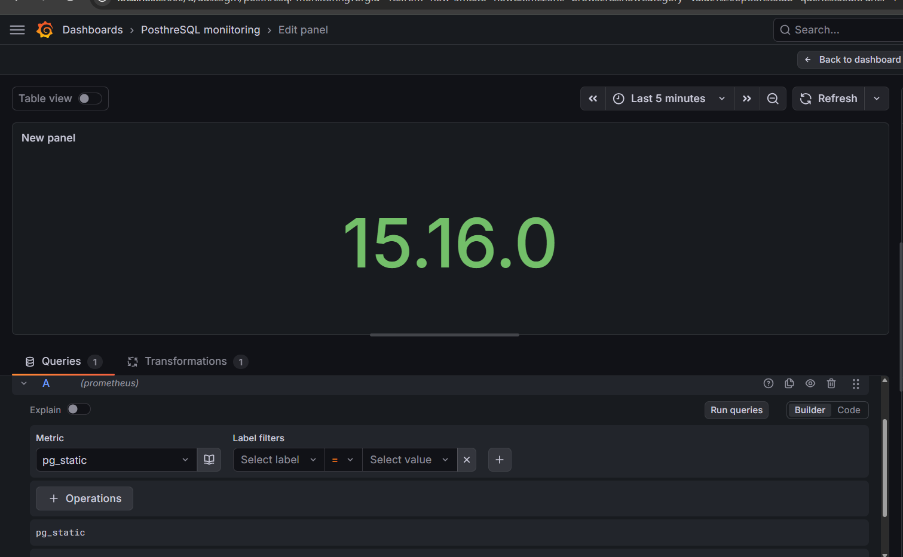

## Активные сессии
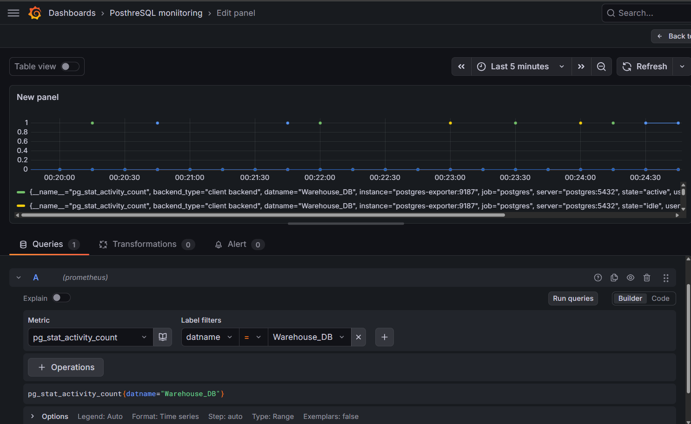

## график с SELECT
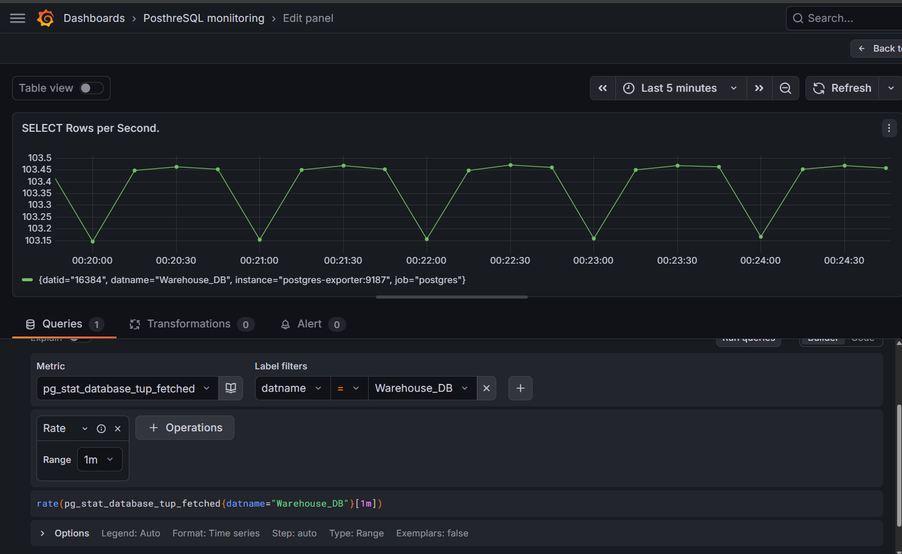

## график с INSERT
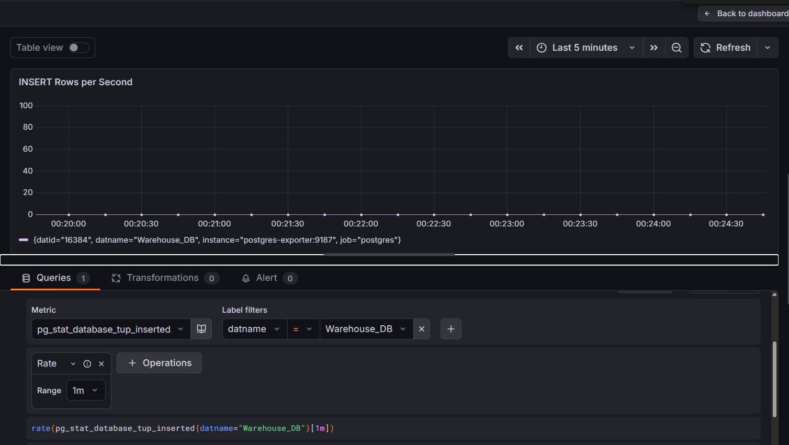

## график с DELETE
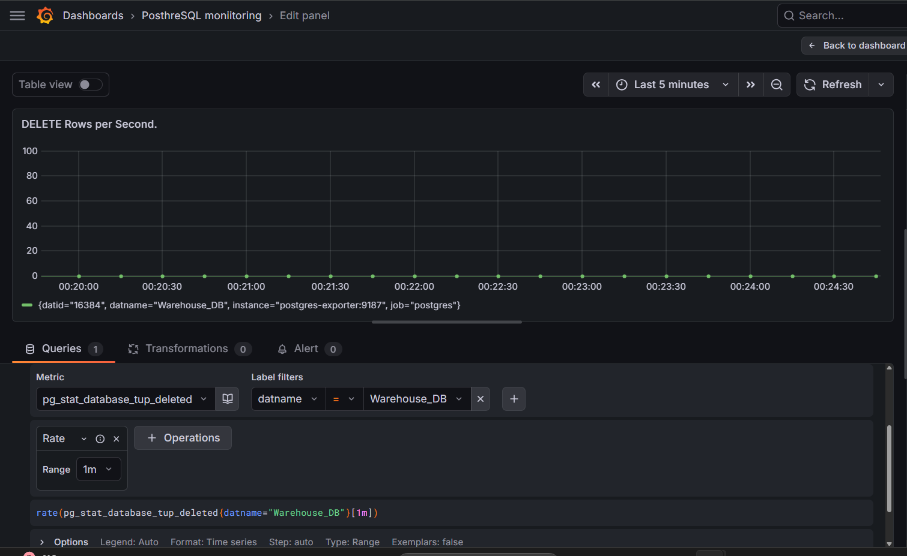

## Аverage CPU Usage (avg(rate(process_cpu_seconds_total{release="$release", instance="$instance"}[5m]) * 1000))
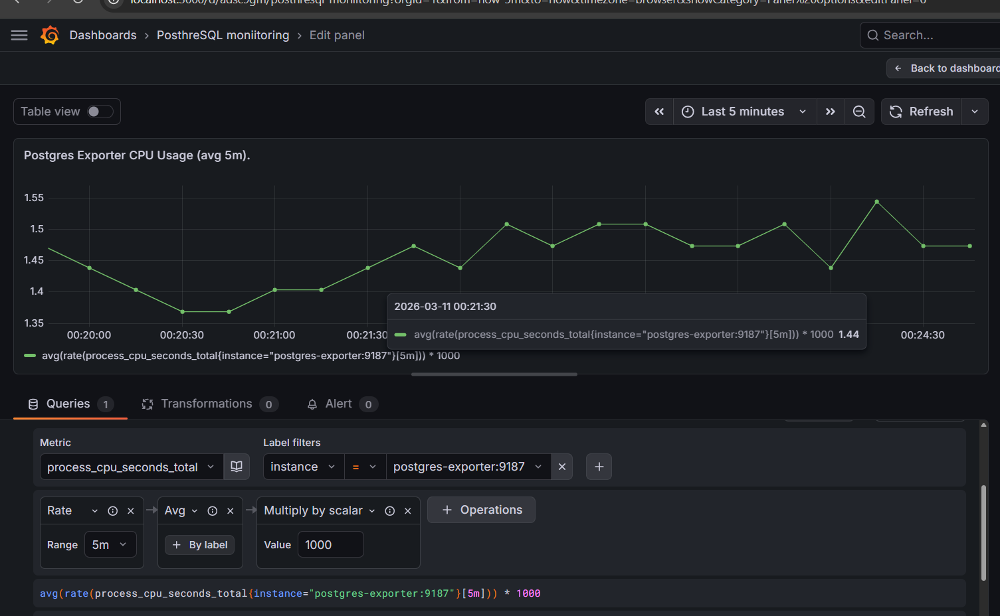

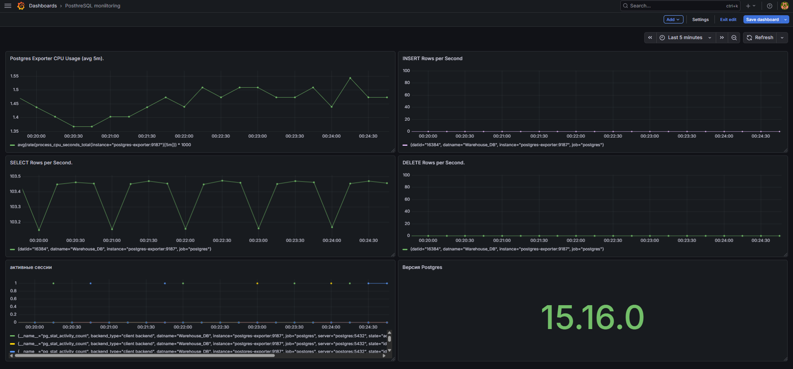

Некоторые графики это просто прямая линия, т.к. необходимых действий не происходило 


