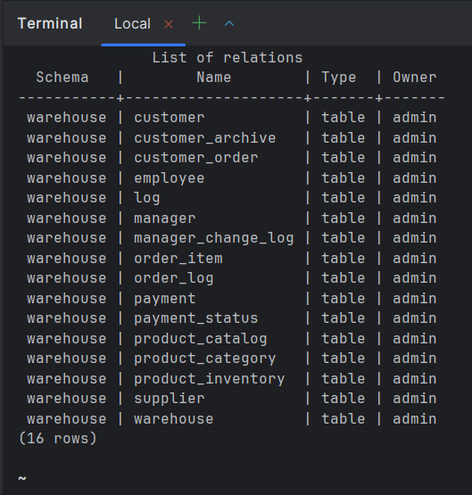
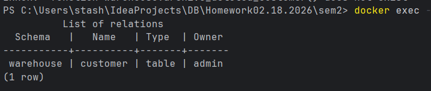

# изменение LSN и WAL после изменения данных 

## Сравнение LSN до и после INSERT

```sql
SELECT pg_current_wal_lsn() AS lsn_before;

--получили 1/1443BA0

INSERT INTO warehouse.customer (last_name, first_name, email)
VALUES ('Тестов', 'Тест', 'test@example.com');

SELECT pg_current_wal_lsn() AS lsn_after;

--получили 1/14491F8

SELECT pg_wal_lsn_diff('1/1443BA0', '1/14491F8') AS wal_bytes;

--получили -22104
--вывод: в wal появилась новая запись поэтому lsn увеличил
```
### вывод
при insert lsn увеличивается, так как появляется новая запись


## Сравнение WAL до и после commit

```sql
BEGIN;
SELECT pg_current_wal_lsn() AS before_insert;

-- 1/14492E0

INSERT INTO warehouse.customer (last_name, first_name, email)
VALUES ('Тестов', 'Тест', 'test@example.com');

SELECT pg_current_wal_lsn() AS after_insert;

-- 1/144C740

SELECT pg_wal_lsn_diff('1/144C740', '1/14492E0') AS wal_bytes;

-- 13408

COMMIT;

SELECT pg_current_wal_lsn() AS after_commit;

-- 1/144DC58

SELECT pg_wal_lsn_diff('1/144DC58', '1/144C740') AS wal_bytes;

-- 5400
```
### вывод
COMMIT добавляет отдельную небольшую(меньше чем при insert'е) запись в WAL

## Анализ WAL размера после массовой операции

```sql
SELECT pg_current_wal_lsn() AS before_mass;

-- 1/144DD40

INSERT INTO warehouse.customer (last_name, first_name, email)
SELECT 'Фамилия' || gs, 'Имя' || gs, 'user' || gs || '@example.com'
FROM generate_series(1, 100000) gs;

SELECT pg_current_wal_lsn() AS after_mass;

-- 1/685B970

SELECT pg_wal_lsn_diff('1/685B970', '1/144DD40') AS total_wal_bytes;

-- 88136752
```

### вывод
Получили ООчень большое смещение

# Дампы

## дамп схемы всей бд

```shell
& "C:\Program Files\PostgreSQL\17\bin\pg_dump.exe"  -U admin -h localhost -p 5433 -d Warehouse_DB --schema-only -f dump_schema.sql

docker exec -it practice_db psql -U admin -d postgres -c "CREATE DATABASE Warehouse_DB_new;"

Get-Content dump_schema.sql | docker exec -i practice_db psql -U admin -d warehouse_db_new

docker exec -it practice_db psql -U admin -d warehouse_db_new -c "\dt warehouse.*"                                        
```


## дамп схемы только одной таблицы

```shell
 & "C:\Program Files\PostgreSQL\17\bin\pg_dump.exe" -U admin -h localhost -p 5433 -d Warehouse_DB -t warehouse.customer --schema-only -f dump_customer_schema.sql
 
 docker exec -it practice_db psql -U admin -d postgres -c "CREATE DATABASE warehouse_db_customer;"
 
 docker exec -i practice_db psql -U admin -d warehouse_db_customer -c "CREATE SCHEMA warehouse;"
 
 Get-Content dump_customer_schema.sql | docker exec -i practice_db psql -U admin -d warehouse_db_customer
```


# Seed

```sql
-- Идемпотентная вставка категорий
INSERT INTO warehouse.product_category (id, name)
VALUES 
  (1, 'Овощи'),
  (2, 'Фрукты'),
  (3, 'Молочные продукты'),
  (4, 'Мясные продукты'),
  (5, 'Бакалея'),
  (6, 'Напитки')
ON CONFLICT (id) DO NOTHING;

INSERT INTO warehouse.payment_status (id, status)
VALUES
    (1, 'Ожидает'),
    (2, 'Оплачено'),
    (3, 'В процессе сборки'),
    (4, 'Отменено')
    ON CONFLICT (id) DO NOTHING;

INSERT INTO warehouse.customer (last_name, first_name, email, metadata, tags)
VALUES ('Петров', 'Пётр', 'petrov@example.com', '{"role": "tester"}'::jsonb, ARRAY['test'])
    ON CONFLICT (email) DO NOTHING;
```

