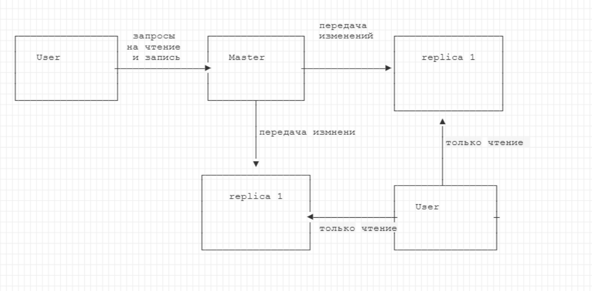
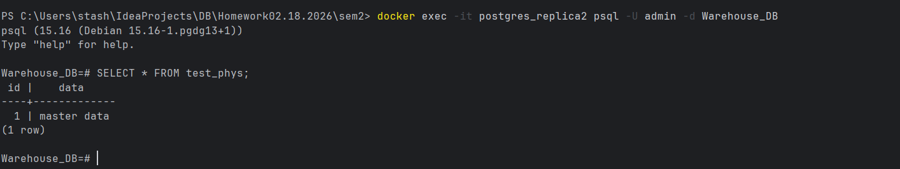
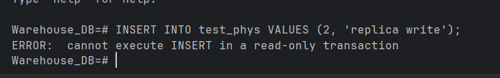
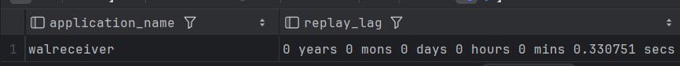
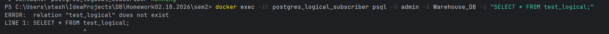
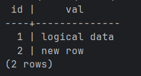
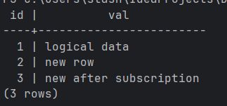
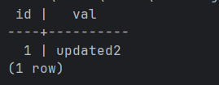
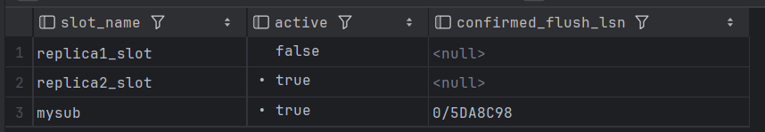
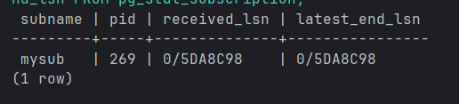

```bash
docker-compose up -d postgres flyway postgres-exporter prometheus grafana

docker exec -it practice_db psql -U admin -d Warehouse_DB -c "CREATE ROLE replicator WITH REPLICATION LOGIN PASSWORD 'rep_pass';"
docker exec -it practice_db psql -U admin -d Warehouse_DB -c "SELECT pg_create_physical_replication_slot('replica1_slot');"
docker exec -it practice_db psql -U admin -d Warehouse_DB -c "SELECT pg_create_physical_replication_slot('replica2_slot');"
docker exec -it practice_db bash -c "echo 'host replication replicator 0.0.0.0/0 md5' >> /var/lib/postgresql/data/pg_hba.conf"
docker exec -it practice_db psql -U admin -d Warehouse_DB -c "SELECT pg_reload_conf();"


docker run --rm -v ${PWD}/replica1_data:/replica1 --network sem2_default -e PGPASSWORD=rep_pass postgres:15 pg_basebackup -h postgres -U replicator -D /replica1 -Fp -Xs -P -R
docker run --rm -v ${PWD}/replica2_data:/replica2 --network sem2_default -e PGPASSWORD=rep_pass postgres:15 pg_basebackup -h postgres -U replicator -D /replica2 -Fp -Xs -P -R
```

## Физическая репликация
#### вставляем на master
```sql
CREATE TABLE test_phys (id INT PRIMARY KEY, data TEXT);
INSERT INTO test_phys VALUES (1, 'master data');
```
#### на реплике данные тоже появились

#### при этом вставка данных на реплику невозможна


#### проверка при высокой нагрузке
```sql
INSERT INTO test_phys SELECT generate_series(2, 100000), 'load';

SELECT application_name, replay_lag FROM pg_stat_replication;
```


## Логическая репликация

###  Создание таблиц для тестов
```sql
CREATE TABLE test_logical (id INT PRIMARY KEY, val TEXT);
INSERT INTO test_logical VALUES (1, 'logical data'), (2, 'new row');

CREATE TABLE no_pk (id INT, val TEXT);
INSERT INTO no_pk VALUES (1, 'initial');
```
### созданные на мастере таблицы не дублируются на логическую реплику

### дублируем на реплику 
```bash
docker exec -it postgres_logical_subscriber psql -U admin -d Warehouse_DB -c "CREATE TABLE test_logical (id INT PRIMARY KEY, val TEXT);"
docker exec -it postgres_logical_subscriber psql -U admin -d Warehouse_DB -c "CREATE TABLE no_pk (id INT, val TEXT);"
```
### Создание публикации
```sql
CREATE PUBLICATION mypub FOR TABLE test_logical, no_pk;
```
### Создание подписки
почему-то создане на мастере было невозможно, выдавалась ошибка о wal_level, хотя он стоял нужный
```bash
docker exec -it postgres_logical_subscriber psql -U admin -d Warehouse_DB -c "
CREATE SUBSCRIPTION mysub
CONNECTION 'host=postgres port=5432 user=admin password=admin_pass dbname=Warehouse_DB'
PUBLICATION mypub;"                           
```
### данные перенесены
```bash
docker exec -it postgres_logical_subscriber psql -U admin -d Warehouse_DB -c "SELECT * FROM test_logical;"
```


### финальная проверка
вставка на мастер
```sql
INSERT INTO test_logical VALUES (3, 'new after subscription');
```
на реплике 
```bash
docker exec -it postgres_logical_subscriber psql -U admin -d Warehouse_DB -c "SELECT * FROM test_logical;"
```


### попытка обновить таблицу на мастере без pk и replica_identity
```bash
[2026-03-31 18:39:06] Warehouse_DB.public> UPDATE no_pk SET val = 'updated' WHERE id = 1
[2026-03-31 18:39:06] [55000] ERROR: cannot update table "no_pk" because it does not have a replica identity and publishes updates
[2026-03-31 18:39:06] Подсказка: To enable updating the table, set REPLICA IDENTITY using ALTER TABLE
```

```bash
[2026-03-31 18:41:16] Warehouse_DB.public> ALTER TABLE no_pk REPLICA IDENTITY FULL
[2026-03-31 18:41:16] completed in 10 ms
[2026-03-31 18:41:19] Warehouse_DB.public> UPDATE no_pk SET val = 'updated2' WHERE id = 1
[2026-03-31 18:41:19] 1 row affected in 7 ms
```
```bash
docker exec -it postgres_logical_subscriber psql -U admin -d Warehouse_DB -c "SELECT * FROM no_pk"  
```


### статус логической репликации
мастер:

реплика:




### Роль pg_dump/pg_restore для логической репликации
Если таблицы большие, можно сначала скопировать начальные данные через pg_dump / pg_restore, а затем создать подписку с опцией COPY_DATA = false. Это ускоряет инициализацию и снижает нагрузку на сеть. Пример:

```shell
pg_dump -U admin -h localhost -p 5433 -t test_logical -Fc -f test_logical.dump Warehouse_DB

pg_restore -U admin -h localhost -p 5436 -d Warehouse_DB test_logical.dump

CREATE SUBSCRIPTION mysub ... WITH (copy_data = false);
```