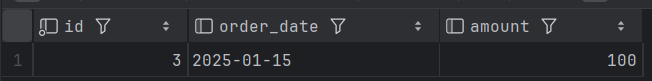
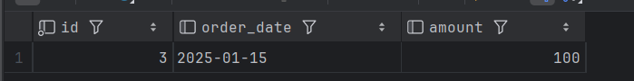
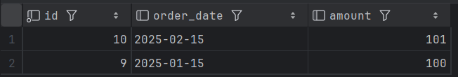
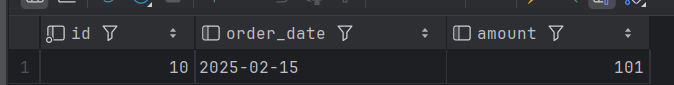
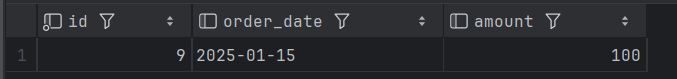

# секционирование 
## RANGE
подготавливаем секции
```sql
CREATE TABLE orders_range (
  id SERIAL,
  order_date DATE NOT NULL,
  customer_id INT,
  amount NUMERIC
) PARTITION BY RANGE (order_date);

CREATE TABLE orders_range_2025_01 PARTITION OF orders_range
    FOR VALUES FROM ('2025-01-01') TO ('2025-02-01');
CREATE TABLE orders_range_2025_02 PARTITION OF orders_range
    FOR VALUES FROM ('2025-02-01') TO ('2025-03-01');
CREATE TABLE orders_range_2025_03 PARTITION OF orders_range
    FOR VALUES FROM ('2025-03-01') TO ('2025-04-01');
CREATE TABLE orders_range_default PARTITION OF orders_range DEFAULT;

CREATE INDEX idx_orders_range_date ON orders_range (order_date);

INSERT INTO orders_range (order_date, customer_id, amount)
SELECT
    '2025-01-01'::date + (random() * 60)::int,
    (random() * 100)::int,
    (random() * 1000)::numeric
FROM generate_series(1, 10000);
```
```sql
EXPLAIN (ANALYZE, BUFFERS)
SELECT * FROM orders_range
WHERE order_date >= '2025-02-01' AND order_date < '2025-03-01';
```
```
Seq Scan on orders_range_2025_02 orders_range  (cost=0.00..99.00 rows=4600 width=23) (actual time=0.005..0.437 rows=4600 loops=1)
  Filter: ((order_date >= '2025-02-01'::date) AND (order_date < '2025-03-01'::date))
  Buffers: shared hit=30
Planning:
  Buffers: shared hit=81
Planning Time: 1.866 ms
Execution Time: 0.700 ms
```
видно, что используется только одна секция, значит partition pruning есть 

индекс не используется, так как данных мало

```sql
EXPLAIN (ANALYZE, BUFFERS)
SELECT * FROM orders_range
WHERE order_date BETWEEN '2025-01-15' AND '2025-02-15';
```
```
Append  (cost=0.00..237.08 rows=5404 width=23) (actual time=0.013..3.865 rows=5404 loops=1)
  Buffers: shared hit=64
  ->  Seq Scan on orders_range_2025_01 orders_range_1  (cost=0.00..111.05 rows=2876 width=23) (actual time=0.012..2.515 rows=2876 loops=1)
        Filter: ((order_date >= '2025-01-15'::date) AND (order_date <= '2025-02-15'::date))
        Rows Removed by Filter: 2261
        Buffers: shared hit=34
  ->  Seq Scan on orders_range_2025_02 orders_range_2  (cost=0.00..99.00 rows=2528 width=23) (actual time=0.016..0.759 rows=2528 loops=1)
        Filter: ((order_date >= '2025-01-15'::date) AND (order_date <= '2025-02-15'::date))
        Rows Removed by Filter: 2072
        Buffers: shared hit=30
Planning:
  Buffers: shared hit=51 dirtied=1
Planning Time: 3.594 ms
Execution Time: 4.213 ms
```
используются секции orders_range_2025_01 и orders_range_2025_02. partition pruning есть.
индекс не используется, так как данных мало

## LIST

подготовка секции
```sql
CREATE TABLE products_list (
    id SERIAL,
    category VARCHAR(20) NOT NULL,
    name TEXT,
    price NUMERIC
) PARTITION BY LIST (category);

-- Секции для разных категорий
CREATE TABLE products_list_elec PARTITION OF products_list
    FOR VALUES IN ('electronics');
CREATE TABLE products_list_cloth PARTITION OF products_list
    FOR VALUES IN ('clothing');
CREATE TABLE products_list_other PARTITION OF products_list
    DEFAULT;  -- секция по умолчанию

-- Индекс на ключе секционирования
CREATE INDEX idx_products_list_category ON products_list (category);

INSERT INTO products_list (category, name, price)
SELECT
    CASE (random() * 2)::int
        WHEN 0 THEN 'electronics'
        WHEN 1 THEN 'clothing'
        ELSE 'books'
END,
    'product_' || gs,
    (random() * 100)::numeric
FROM generate_series(1, 10000);
```
```sql
EXPLAIN (ANALYZE, BUFFERS)
SELECT * FROM products_list WHERE category = 'electronics';
```
```
Bitmap Heap Scan on products_list_elec products_list  (cost=4.32..19.21 rows=6 width=126) (actual time=0.080..0.520 rows=2470 loops=1)
  Recheck Cond: ((category)::text = 'electronics'::text)
  Heap Blocks: exact=23
  Buffers: shared hit=26
  ->  Bitmap Index Scan on products_list_elec_category_idx  (cost=0.00..4.32 rows=6 width=0) (actual time=0.062..0.062 rows=2470 loops=1)
        Index Cond: ((category)::text = 'electronics'::text)
        Buffers: shared hit=3
Planning:
  Buffers: shared hit=16
Planning Time: 0.266 ms
Execution Time: 0.731 ms
```
используется только секция products_list_elec. partition pruning есть. используется индекс, созданный вместе с idx_products_list_category

```sql
EXPLAIN (ANALYZE, BUFFERS)
SELECT * FROM products_list WHERE category IN ('electronics', 'clothing');
```
```
Append  (cost=0.00..197.44 rows=7511 width=38) (actual time=0.012..2.394 rows=7511 loops=1)
  Buffers: shared hit=66
  ->  Seq Scan on products_list_cloth products_list_1  (cost=0.00..106.01 rows=5041 width=37) (actual time=0.012..1.198 rows=5041 loops=1)
"        Filter: ((category)::text = ANY ('{electronics,clothing}'::text[]))"
        Buffers: shared hit=43
  ->  Seq Scan on products_list_elec products_list_2  (cost=0.00..53.88 rows=2470 width=40) (actual time=0.013..0.416 rows=2470 loops=1)
"        Filter: ((category)::text = ANY ('{electronics,clothing}'::text[]))"
        Buffers: shared hit=23
Planning:
  Buffers: shared hit=52
Planning Time: 0.663 ms
Execution Time: 2.851 ms
```
используется 2 секции. partition pruning есть. индексы не используются.. почему-то

## HASH

подготовка секции
```sql
CREATE TABLE users_hash (
    id SERIAL,
    name TEXT,
    email TEXT
) PARTITION BY HASH (id);

CREATE TABLE users_hash_0 PARTITION OF users_hash
    FOR VALUES WITH (MODULUS 4, REMAINDER 0);
CREATE TABLE users_hash_1 PARTITION OF users_hash
    FOR VALUES WITH (MODULUS 4, REMAINDER 1);
CREATE TABLE users_hash_2 PARTITION OF users_hash
    FOR VALUES WITH (MODULUS 4, REMAINDER 2);
CREATE TABLE users_hash_3 PARTITION OF users_hash
    FOR VALUES WITH (MODULUS 4, REMAINDER 3);

CREATE INDEX idx_users_hash_id ON users_hash (id);

INSERT INTO users_hash (name, email)
SELECT 'user_' || gs, 'user' || gs || '@example.com'
FROM generate_series(1, 100000) gs;
```
```sql
EXPLAIN (ANALYZE, BUFFERS)
SELECT * FROM users_hash WHERE id = 12345;
```
```
Index Scan using users_hash_0_id_idx on users_hash_0 users_hash  (cost=0.29..8.30 rows=1 width=35) (actual time=0.073..0.074 rows=1 loops=1)
  Index Cond: (id = 12345)
  Buffers: shared hit=3
Planning:
  Buffers: shared hit=54
Planning Time: 6.521 ms
Execution Time: 0.093 ms
```
используется только одна секция. partition pruning есть. индекс используется

```sql
EXPLAIN (ANALYZE, BUFFERS)
SELECT * FROM users_hash WHERE id BETWEEN 10000 AND 20000;
```

```
Append  (cost=0.29..472.10 rows=9998 width=35) (actual time=0.034..2.625 rows=10001 loops=1)
  Buffers: shared hit=124
  ->  Index Scan using users_hash_0_id_idx on users_hash_0 users_hash_1  (cost=0.29..106.01 rows=2486 width=35) (actual time=0.033..0.395 rows=2483 loops=1)
        Index Cond: ((id >= 10000) AND (id <= 20000))
        Buffers: shared hit=31
  ->  Index Scan using users_hash_1_id_idx on users_hash_1 users_hash_2  (cost=0.29..106.45 rows=2508 width=35) (actual time=0.042..0.431 rows=2521 loops=1)
        Index Cond: ((id >= 10000) AND (id <= 20000))
        Buffers: shared hit=31
  ->  Index Scan using users_hash_2_id_idx on users_hash_2 users_hash_3  (cost=0.29..107.81 rows=2526 width=35) (actual time=0.035..0.459 rows=2521 loops=1)
        Index Cond: ((id >= 10000) AND (id <= 20000))
        Buffers: shared hit=31
  ->  Index Scan using users_hash_3_id_idx on users_hash_3 users_hash_4  (cost=0.29..101.85 rows=2478 width=35) (actual time=0.076..0.467 rows=2476 loops=1)
        Index Cond: ((id >= 10000) AND (id <= 20000))
        Buffers: shared hit=31
Planning:
  Buffers: shared hit=124 dirtied=3
Planning Time: 73.558 ms
Execution Time: 3.116 ms
```

partition pruning нет: используются все секции, однако условие на id всё равно позволяет использовать индекс

# физическаая репликация
```sql
--на мастере 
CREATE TABLE test_part (a int) PARTITION BY RANGE (a);
CREATE TABLE test_part_1 PARTITION OF test_part FOR VALUES FROM (1) TO (10);
CREATE TABLE test_part_2 PARTITION OF test_part FOR VALUES FROM (10) TO (20);
INSERT INTO test_part VALUES (5);
INSERT INTO test_part VALUES (15);

--на реплике
SELECT * FROM test_part;
SELECT * FROM test_part_1;
```
запрос на физической реплике, выполняется как к родительскому
отношению, так и к дочерним. К тому же в интерфейсе IDEA
показывает что у таблицы есть partitions(секции),
поэтому я считаю, что вопрос о знании реплики о секциях относится 
не к физической реплике, а к логической

# Логическая репликация
## publish_via_partition_root = off
подготовка
```sql
--на мастере
CREATE TABLE orders_part (
     id SERIAL,
     order_date DATE,
     amount NUMERIC
) PARTITION BY RANGE (order_date);

CREATE TABLE orders_part_2025_01 PARTITION OF orders_part
    FOR VALUES FROM ('2025-01-01') TO ('2025-02-01');
CREATE TABLE orders_part_2025_02 PARTITION OF orders_part
    FOR VALUES FROM ('2025-02-01') TO ('2025-03-01');
CREATE TABLE orders_part_default PARTITION OF orders_part DEFAULT;

CREATE PUBLICATION pub_orders FOR TABLE orders_part;
       
--на реплике

CREATE TABLE orders_part (
     id SERIAL,
     order_date DATE,
     amount NUMERIC
) PARTITION BY RANGE (order_date);

CREATE TABLE orders_part_2025_01 PARTITION OF orders_part
    FOR VALUES FROM ('2025-01-01') TO ('2025-02-01');
CREATE TABLE orders_part_2025_02 PARTITION OF orders_part
    FOR VALUES FROM ('2025-02-01') TO ('2025-03-01');
CREATE TABLE orders_part_default PARTITION OF orders_part DEFAULT;

CREATE SUBSCRIPTION sub_orders
    CONNECTION 'host=postgres port=5432 dbname=Warehouse_DB user=admin password=admin_pass'
    PUBLICATION pub_orders;
```
проверка
```sql
--на мастере
INSERT INTO orders_part (order_date, amount) VALUES ('2025-01-15', 100);

--на реплике
SELECT * FROM orders_part;
SELECT * FROM orders_part_2025_01;
```



## publish_via_partition_root = on

```sql
-- на мастере
ALTER PUBLICATION pub_orders SET (publish_via_partition_root = on);

--на реплике
CREATE TABLE orders_part (
     id SERIAL,
     order_date DATE,
     amount NUMERIC
) PARTITION BY HASH (amount);

CREATE TABLE orders_part_hash0 PARTITION OF orders_part
    FOR VALUES WITH (MODULUS 2, REMAINDER 0);
CREATE TABLE orders_part_hash1 PARTITION OF orders_part
    FOR VALUES WITH (MODULUS 2, REMAINDER 1);

CREATE SUBSCRIPTION sub_orders
    CONNECTION 'host=publisher port=5432 dbname=pub_db user=admin password=pass'
    PUBLICATION pub_orders;
```
проверка
```sql
--на мастере
INSERT INTO orders_part (order_date, amount) VALUES ('2025-02-15', 100);
INSERT INTO orders_part (order_date, amount) VALUES ('2025-02-15', 101);
--на реплике

SELECT * FROM orders_part;

SELECT * FROM orders_part_hash0;
SELECT * FROM orders_part_hash1;
```




# Шардирование
на шард1
```sql
CREATE SCHEMA IF NOT EXISTS shard;
CREATE TABLE shard.orders_shard (
    id SERIAL PRIMARY KEY,
    user_id INT NOT NULL,
    amount NUMERIC,
    created_at DATE
);

INSERT INTO shard.orders_shard (user_id, amount, created_at)
SELECT gs, (random() * 1000)::numeric, CURRENT_DATE - (random() * 365)::int
FROM generate_series(1, 2000) gs
WHERE gs % 2 = 1;
```
на шард2
```sql
CREATE SCHEMA IF NOT EXISTS shard;
CREATE TABLE shard.orders_shard (
    id SERIAL PRIMARY KEY,
    user_id INT NOT NULL,
    amount NUMERIC,
    created_at DATE
);

INSERT INTO shard.orders_shard (user_id, amount, created_at)
SELECT gs, (random() * 1000)::numeric, CURRENT_DATE - (random() * 365)::int
FROM generate_series(1, 2000) gs
WHERE gs % 2 = 0;
```
на роутер
```sql
CREATE EXTENSION IF NOT EXISTS postgres_fdw;

CREATE SERVER shard1_server FOREIGN DATA WRAPPER postgres_fdw
OPTIONS (host 'postgres_shard1', port '5432', dbname 'Warehouse_DB');

CREATE SERVER shard2_server FOREIGN DATA WRAPPER postgres_fdw
OPTIONS (host 'postgres_shard2', port '5432', dbname 'Warehouse_DB');

CREATE USER MAPPING FOR admin SERVER shard1_server OPTIONS (user 'admin', password 'admin_pass');
CREATE USER MAPPING FOR admin SERVER shard2_server OPTIONS (user 'admin', password 'admin_pass');

CREATE FOREIGN TABLE orders_shard1 (
    id INT,
    user_id INT,
    amount NUMERIC,
    created_at DATE
) SERVER shard1_server OPTIONS (schema_name 'shard', table_name 'orders_shard');

CREATE FOREIGN TABLE orders_shard2 (
    id INT,
    user_id INT,
    amount NUMERIC,
    created_at DATE
) SERVER shard2_server OPTIONS (schema_name 'shard', table_name 'orders_shard');

CREATE TABLE orders_global (
    id INT,
    user_id INT,
    amount NUMERIC,
    created_at DATE
) PARTITION BY HASH (user_id);

ALTER TABLE orders_global ATTACH PARTITION orders_shard1
    FOR VALUES WITH (MODULUS 2, REMAINDER 1);

ALTER TABLE orders_global ATTACH PARTITION orders_shard2
    FOR VALUES WITH (MODULUS 2, REMAINDER 0);
```
```sql
EXPLAIN (ANALYZE, BUFFERS) SELECT * FROM orders_global;
```
```
                                                       QUERY PLAN                                                                 
--------------------------------------------------------------------------------------------------------------------------------------------
 Append  (cost=100.00..304.28 rows=2408 width=44) (actual time=3.780..11.765 rows=2000 loops=1)
   ->  Foreign Scan on orders_shard2 orders_global_1  (cost=100.00..146.12 rows=1204 width=44) (actual time=3.778..6.380 rows=1000 loops=1)
   ->  Foreign Scan on orders_shard1 orders_global_2  (cost=100.00..146.12 rows=1204 width=44) (actual time=2.745..5.215 rows=1000 loops=1)
 Planning:
   Buffers: shared hit=82 read=3
 Planning Time: 5.413 ms
 Execution Time: 96.621 ms
(7 rows)
```

```sql
EXPLAIN (ANALYZE, BUFFERS) SELECT * FROM orders_global WHERE user_id = 100;
```

```
                                                          QUERY PLAN                                                          
------------------------------------------------------------------------------------------------------------------------------
 Foreign Scan on orders_shard1 orders_global  (cost=100.00..125.17 rows=6 width=44) (actual time=1.162..1.163 rows=0 loops=1)
 Planning:
   Buffers: shared read=6
 Planning Time: 4.451 ms
 Execution Time: 1.870 ms
(5 rows)
```