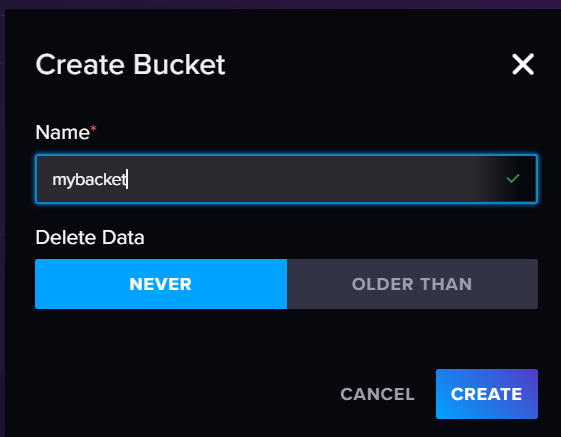
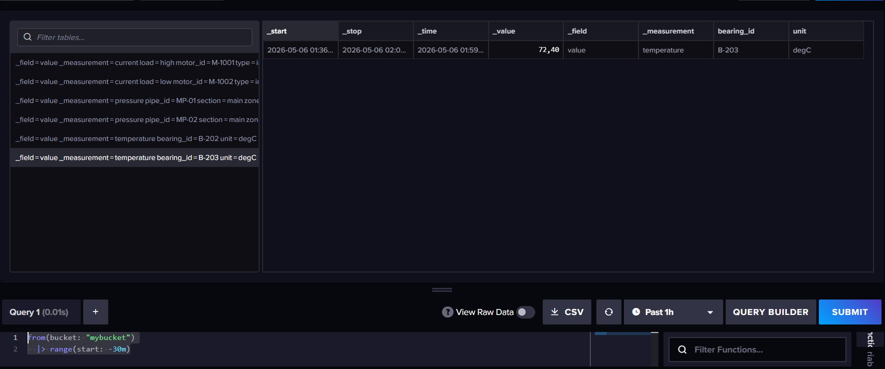
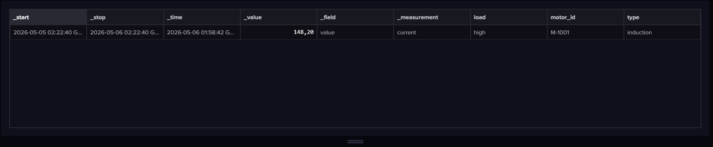
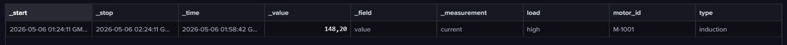
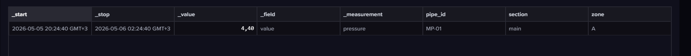
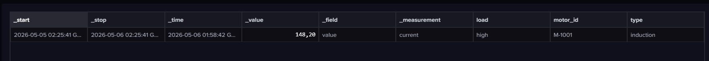
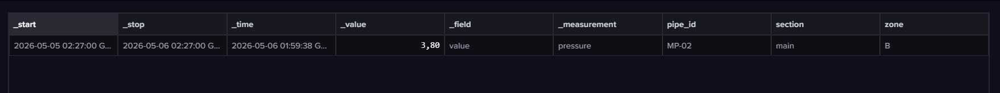
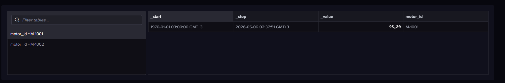
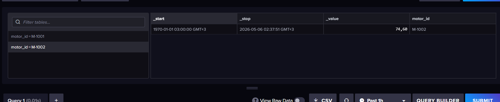
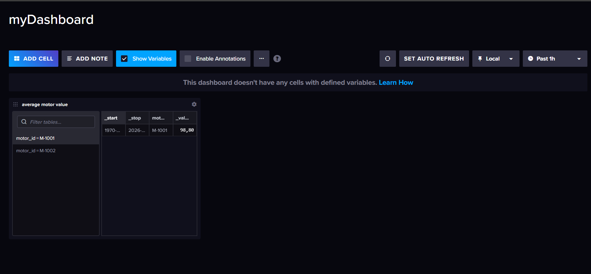

# создани bucket


## запросы
Вставляем данные 
Используем Line Protocol
```text
current,motor_id=M-1001,type=induction,load=high value=148.2
current,motor_id=M-1002,type=induction,load=low value=86.9
```

```text
pressure,pipe_id=MP-02,section=main,zone=B value=3.8
pressure,pipe_id=MP-01,section=main,zone=A value=4.4
```
```text
temperature,bearing_id=B-202,unit=degC value=65.0
temperature,bearing_id=B-203,unit=degC value=72.4
```
### 1
```text
from(bucket: "mybucket")
  |> range(start: -30m)
```
как визуализировать данные в лучшем виде я так и не понял


### 2
```text
from(bucket: "mybucket")
  |> range(start: -1d)
  |> filter(fn: (r) => r._measurement == "current" and r.motor_id == "M-1001")
```


### 3
```text
from(bucket: "mybucket")
  |> range(start: -1h)
  |> filter(fn: (r) => r._measurement == "current" and r.motor_id == "M-1001")
  |> max(column: "_value")
```

### 4
```text
from(bucket: "mybucket")
  |> range(start: -6h)
  |> filter(fn: (r) => r._measurement == "pressure" and r.pipe_id == "MP-01")
  |> mean(column: "_value")
```

### 5
```text
from(bucket: "mybucket")
  |> range(start: -1d)
  |> filter(fn: (r) => r._measurement == "current")
  |> filter(fn: (r) => r._value > 140.0)
```


### 6
```text
from(bucket: "mybucket")
  |> range(start: -1d)
  |> filter(fn: (r) => r._measurement == "pressure")
  |> filter(fn: (r) => r._value < 4.0)
```

### 7
добавляем данные для аггрегации
```text
current,motor_id=M-1001,type=induction,load=high value=148.2
current,motor_id=M-1002,type=induction,load=low value=86.9
current,motor_id=M-1001,type=induction,load=high value=0
current,motor_id=M-1002,type=induction,load=low value=50
```
```text
from(bucket: "mybucket")
  |> range(start: 1970-01-01T00:00:00Z)
  |> filter(fn: (r) => r._measurement == "current")
  |> group(columns: ["motor_id"])
  |> mean(column: "_value")
```



## создание dashboard
