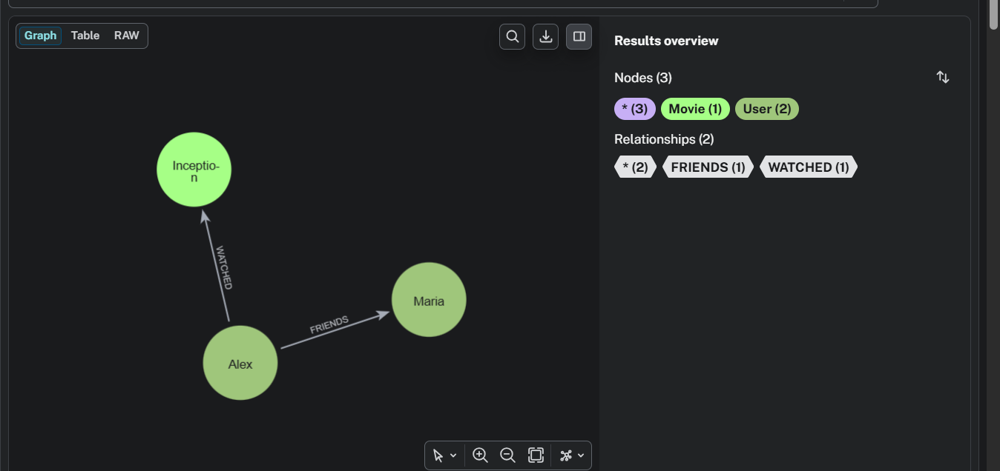
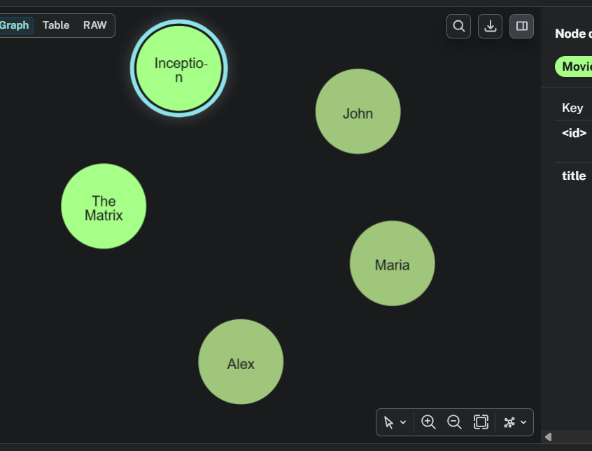
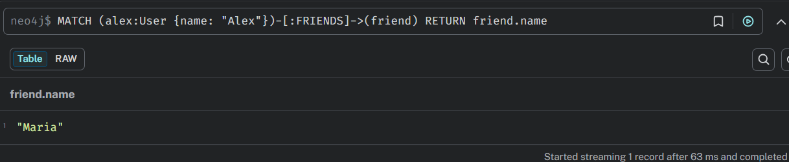
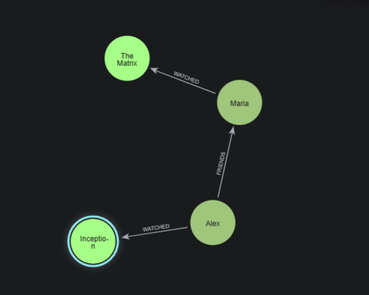
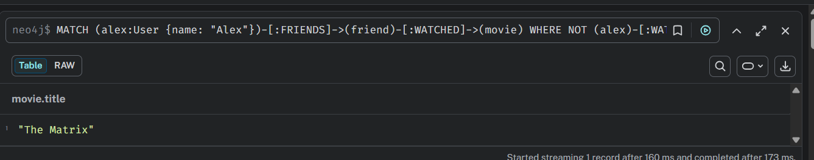

# Поднятие БД
создаём docker-compose.yaml
```shell
 docker-compose up -d
```

# Создание Nodes и Relations
через http://localhost:7474
```sql
CREATE (alex:User {name: "Alex"}),
       (maria:User {name: "Maria"}),
       (john:User {name: "John"});

CREATE (inception:Movie {title: "Inception"}),
       (matrix:Movie {title: "The Matrix"});

MATCH (a:User {name: "Alex"}), (m:User {name: "Maria"})
CREATE (a)-[:FRIENDS]->(m);

MATCH (a:User {name: "Alex"}), (i:Movie {title: "Inception"})
CREATE (a)-[:WATCHED {rating: 5}]->(i);
```



# Запросы
## Neo4j
### 1
найти друзей Alex
```sql
MATCH (alex:User {name: "Alex"})-[:FRIENDS]->(friend)
RETURN friend.name
```

### 2
подготовим данные:
```sql
MATCH (maria:User {name: "Maria"}), (matrix:Movie {title: "The Matrix"})
CREATE (maria)-[:WATCHED {rating: 4}]->(matrix);
```

найти фильм, который смотрели друзья Alex, но не сам Alex
```sql
MATCH (alex:User {name: "Alex"})-[:FRIENDS]->(friend)-[:WATCHED]->(movie)
WHERE NOT (alex)-[:WATCHED]->(movie)
RETURN DISTINCT movie.title
```


## PostgresSQL

Предположим, что у нас есть таблицы и данные в них
```sql
--таблицы
CREATE TABLE users (id SERIAL PRIMARY KEY, name TEXT);
CREATE TABLE friends (user_id INT REFERENCES users(id), friend_id INT REFERENCES users(id));
CREATE TABLE movies (id SERIAL PRIMARY KEY, title TEXT);
CREATE TABLE watched (user_id INT REFERENCES users(id), movie_id INT REFERENCES movies(id), rating INT);
--данные
INSERT INTO users (name) VALUES ('Alex'), ('Maria'), ('John');
INSERT INTO movies (title) VALUES ('Inception'), ('The Matrix');
INSERT INTO friends VALUES (1,2); -- Alex → Maria
INSERT INTO watched VALUES (1,1,5); -- Alex → Inception
INSERT INTO watched VALUES (2,2,4); -- Maria → The Matrix
```
### 1

```sql
SELECT u2.name
FROM friends f
JOIN users u1 ON f.user_id = u1.id
JOIN users u2 ON f.friend_id = u2.id
WHERE u1.name = 'Alex';
```

### 2
```sql
WITH alex AS (SELECT id FROM users WHERE name = 'Alex')
SELECT DISTINCT m.title
FROM alex a
         JOIN friends f ON f.user_id = a.id
         JOIN watched w ON w.user_id = f.friend_id
         JOIN movies m ON w.movie_id = m.id
WHERE NOT EXISTS (
    SELECT 1 FROM watched w2
    WHERE w2.user_id = a.id AND w2.movie_id = m.id
);
```

вывод: у postgresSQL много JOIN и подзапросов, плюс длина запроса.