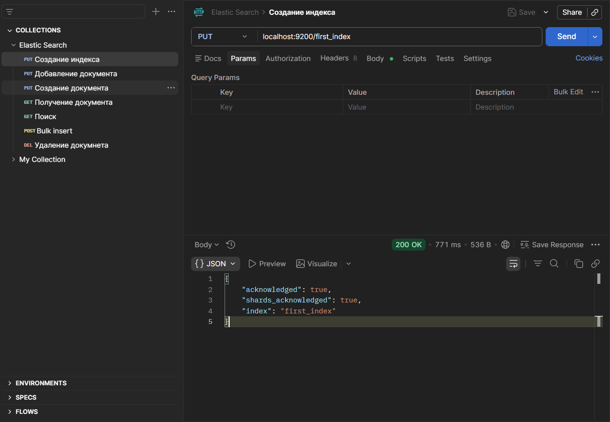

## поднятие контейнера 
```shell
docker run -d --name elasticsearch -p 9200:9200 -p 9300:9300 -e "discovery.type=single-node" elasticsearch:7.17.22
```
через приложение Postman(так как через сайт очень ограниченный доступ к localhost)
выполняем задание:
2. Создать индекс
3. Заполнить данными
4. Написать 4 запроса (поиск по названию, фильтры, `match`, `range`, `term`, `bool`)


## создание индекса 


## заполнение данными 
запрос(часть):

localhost:9200/first_index/_bulk
```json
{"index": {"_index": "first_index", "_id": 2}}
{"title": "Активный стилус", "price": 272.87, "available": true}
{"index": {"_index": "first_index", "_id": 3}}
{"title": "Кулер для процессора", "price": 200.14, "available": true}
```
ответ(часть):
```json
{
    "took": 74,
    "errors": false,
    "items": [
        {
            "index": {
                "_index": "first_index",
                "_type": "_doc",
                "_id": "2",
                "_version": 1,
                "result": "created",
                "_shards": {
                    "total": 2,
                    "successful": 1,
                    "failed": 0
                },
                "_seq_no": 0,
                "_primary_term": 1,
                "status": 201
            }
        },
```
## 4 запроса
### match

Метод GET, URL localhost:9200/first_index/_search
тело запроса:
```json
{
  "query": {
    "match": {
      "title": "наушники"
    }
  }
}
```
ответ:
```json
{
    "took": 58,
    "timed_out": false,
    "_shards": {
        "total": 1,
        "successful": 1,
        "skipped": 0,
        "failed": 0
    },
    "hits": {
        "total": {
            "value": 1,
            "relation": "eq"
        },
        "max_score": 5.176393,
        "hits": [
            {
                "_index": "first_index",
                "_type": "_doc",
                "_id": "39",
                "_score": 5.176393,
                "_source": {
                    "title": "Наушники",
                    "price": 98.16,
                    "available": false
                }
            }
        ]
    }
}
```

### range + term
Метод GET, URL localhost:9200/first_index/_search
тело запроса:
```json
{
  "query": {
    "bool": {
      "must": [
        { "range": { "price": { "gte": 15, "lte": 50 } } },
        { "term": { "available": true } }
      ]
    }
  }
}
```
ответ:
```json
{
    "took": 20,
    "timed_out": false,
    "_shards": {
        "total": 1,
        "successful": 1,
        "skipped": 0,
        "failed": 0
    },
    "hits": {
        "total": {
            "value": 4,
            "relation": "eq"
        },
        "max_score": 1.5987375,
        "hits": [
            {
                "_index": "first_index",
                "_type": "_doc",
                "_id": "23",
                "_score": 1.5987375,
                "_source": {
                    "title": "Термометр",
                    "price": 37.64,
                    "available": true
                }
            },
            {
                "_index": "first_index",
                "_type": "_doc",
                "_id": "41",
                "_score": 1.5987375,
                "_source": {
                    "title": "Игровая консоль",
                    "price": 19.57,
                    "available": true
                }
            },
            {
                "_index": "first_index",
                "_type": "_doc",
                "_id": "42",
                "_score": 1.5987375,
                "_source": {
                    "title": "Зарядное устройство для автомобиля",
                    "price": 19.82,
                    "available": true
                }
            },
            {
                "_index": "first_index",
                "_type": "_doc",
                "_id": "82",
                "_score": 1.5987375,
                "_source": {
                    "title": "Роутер",
                    "price": 47.7,
                    "available": true
                }
            }
        ]
    }
}
```

### range + term
Метод GET, URL localhost:9200/first_index/_search
тело запроса:
```json
{
  "query": {
    "bool": {
      "must": [
        { "match": { "title": "беспроводной" } }
      ],
      "filter": [
        { "range": { "price": { "lt": 100 } } },
        { "term": { "available": true } }
      ]
    }
  }
}
```
ответ
```json
{
    "took": 7,
    "timed_out": false,
    "_shards": {
        "total": 1,
        "successful": 1,
        "skipped": 0,
        "failed": 0
    },
    "hits": {
        "total": {
            "value": 0,
            "relation": "eq"
        },
        "max_score": null,
        "hits": []
    }
}
```

### bool
Метод GET, URL localhost:9200/first_index/_search
тело запроса:
```json
{
  "query": {
    "bool": {
      "must": [
        { "term": { "price": 22.71 } }
      ],
      "must_not": [
        { "term": { "available": true } }
      ]
    }
  }
}
```

ответ
```json
{
    "took": 8,
    "timed_out": false,
    "_shards": {
        "total": 1,
        "successful": 1,
        "skipped": 0,
        "failed": 0
    },
    "hits": {
        "total": {
            "value": 2,
            "relation": "eq"
        },
        "max_score": 1.0,
        "hits": [
            {
                "_index": "first_index",
                "_type": "_doc",
                "_id": "13",
                "_score": 1.0,
                "_source": {
                    "title": "Геймпад",
                    "price": 22.71,
                    "available": false
                }
            },
            {
                "_index": "first_index",
                "_type": "_doc",
                "_id": "20",
                "_score": 1.0,
                "_source": {
                    "title": "Геймпад",
                    "price": 22.71,
                    "available": false
                }
            }
        ]
    }
}
```


