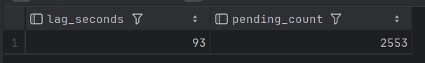
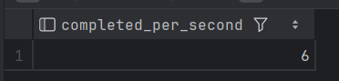

## Создание таблицы
```sql
CREATE TABLE IF NOT EXISTS tasks (
    id BIGSERIAL PRIMARY KEY,
    payload TEXT NOT NULL,
    status SMALLINT NOT NULL DEFAULT 0,      -- 0=ready, 1=running, 2=completed, 3=failed
    priority INT NOT NULL DEFAULT 0,         -- больше = выше приоритет
    attempts INT NOT NULL DEFAULT 0,
    scheduled_at TIMESTAMPTZ NOT NULL DEFAULT NOW(),
    created_at TIMESTAMPTZ NOT NULL DEFAULT NOW(),
    updated_at TIMESTAMPTZ NOT NULL DEFAULT NOW(),
    worker_id TEXT
);

ALTER TABLE tasks SET (
    autovacuum_vacuum_scale_factor = 0.01,
    autovacuum_vacuum_threshold = 100,
    autovacuum_vacuum_cost_delay = 5
    );

-- Индекс для быстрого выбора задач
CREATE INDEX CONCURRENTLY IF NOT EXISTS idx_tasks_ready ON tasks (status, priority DESC, scheduled_at)
    WHERE status = 0;
```
## триггеры для listen/notify
```sql
CREATE OR REPLACE FUNCTION notify_task_channel() RETURNS TRIGGER AS $$
BEGIN
    PERFORM pg_notify('task_channel', NEW.id::text);
    RETURN NEW;
END;
$$ LANGUAGE plpgsql;

CREATE TRIGGER task_notify_trigger
    AFTER INSERT ON tasks
    FOR EACH ROW
    EXECUTE FUNCTION notify_task_channel();
```

## Producer
```java
package ru.kpfu.itis.group400.stashkov.producer;

import ru.kpfu.itis.group400.stashkov.DbUtil;

import java.sql.Connection;
import java.sql.PreparedStatement;
import java.sql.Statement;
import java.util.concurrent.atomic.AtomicLong;

public class Producer {
    private static final int BATCH_SIZE = 10;
    private static final int TARGET_INSERTS_PER_SECOND = 200; // ~20 циклов в секунду

    public static void main(String[] args) throws Exception {
        AtomicLong counter = new AtomicLong(0);
        while (true) {
            long start = System.currentTimeMillis();
            try (Connection conn = DbUtil.getConnection()) {

                try (PreparedStatement pstmt = conn.prepareStatement(
                        "INSERT INTO tasks (payload, priority) VALUES (?, ?)")) {
                    for (int i = 0; i < BATCH_SIZE; i++) {
                        long id = counter.incrementAndGet();
                        String payload = "Task_" + id;
                        int priority = (Math.random() < 0.8) ? 0 : 100;
                        pstmt.setString(1, payload);
                        pstmt.setInt(2, priority);
                        pstmt.addBatch();
                    }
                    pstmt.executeBatch();
                }
                conn.commit();
            }

            long elapsed = System.currentTimeMillis() - start;
            long sleepMs = (1000 / (TARGET_INSERTS_PER_SECOND / BATCH_SIZE)) - elapsed;
            if (sleepMs > 0) Thread.sleep(sleepMs);
        }
    }
}
```
## Consumer (Worker)
```java
package ru.kpfu.itis.group400.stashkov.worker;

import org.postgresql.PGConnection;
import ru.kpfu.itis.group400.stashkov.DbUtil;

import java.sql.*;
import java.util.concurrent.Executors;
import java.util.concurrent.ScheduledExecutorService;
import java.util.concurrent.TimeUnit;
import java.util.concurrent.atomic.AtomicBoolean;

public class Consumer implements Runnable {
    private final String workerId;
    private final AtomicBoolean running = new AtomicBoolean(true);
    private static final int MAX_ATTEMPTS = 3;
    private static final int STUCK_TIMEOUT_SECONDS = 60;

    public Consumer(String workerId) {
        this.workerId = workerId;
    }

    public void stop() {
        running.set(false);
    }

    @Override
    public void run() {
        ScheduledExecutorService scheduler = Executors.newSingleThreadScheduledExecutor();
        scheduler.scheduleAtFixedRate(this::cleanupStuckTasks, 30, 30, TimeUnit.SECONDS);

        try (Connection conn = DbUtil.getConnection()) {
            conn.setAutoCommit(false);
            try (Statement stmt = conn.createStatement()) {
                stmt.execute("LISTEN task_channel");
            }
            conn.commit();

            while (running.get()) {
                PGConnection pgConn = conn.unwrap(PGConnection.class);
                org.postgresql.PGNotification[] notifications = pgConn.getNotifications(1000);
                if (notifications != null && notifications.length > 0) {
                    processOneTask();
                } else {
                    Thread.sleep(5000);
                }
            }
        } catch (Exception e) {
            e.printStackTrace();
        } finally {
            scheduler.shutdown();
        }
    }

    private void processOneTask() {
        Connection conn = null;
        try {
            conn = DbUtil.getConnection();
            conn.setAutoCommit(false);

            String selectSql = """
                SELECT id, payload, priority, attempts
                FROM tasks
                WHERE status = 0 AND scheduled_at <= now()
                ORDER BY priority DESC, scheduled_at
                LIMIT 1
                FOR UPDATE SKIP LOCKED
            """;
            long taskId = -1;
            String payload = null;
            int priority = 0;
            int attempts = 0;
            try (PreparedStatement pstmt = conn.prepareStatement(selectSql)) {
                ResultSet rs = pstmt.executeQuery();
                if (!rs.next()) {
                    conn.commit();
                    return;
                }
                taskId = rs.getLong("id");
                payload = rs.getString("payload");
                priority = rs.getInt("priority");
                attempts = rs.getInt("attempts");
            }

            try (PreparedStatement pstmt = conn.prepareStatement(
                    "UPDATE tasks SET status = 1, worker_id = ?, updated_at = now() WHERE id = ?")) {
                pstmt.setString(1, workerId);
                pstmt.setLong(2, taskId);
                pstmt.executeUpdate();
            }
            conn.commit();

            long processingTime = 200;
            Thread.sleep(processingTime);

            try (PreparedStatement pstmt = conn.prepareStatement(
                    "UPDATE tasks SET status = 2, updated_at = now() WHERE id = ?")) {
                pstmt.setLong(1, taskId);
                pstmt.executeUpdate();
            }
            conn.commit();
            System.out.printf("[%s] Задача %d (priority=%d) выполнена%n", workerId, taskId, priority);

        } catch (Exception e) {
            if (conn != null) {
                try {
                    handleFailure(conn, e);
                } catch (SQLException ex) {
                    ex.printStackTrace();
                }
            }
        } finally {
            if (conn != null) try { conn.close(); } catch (SQLException e) { }
        }
    }

    private void handleFailure(Connection conn, Exception error) throws SQLException {
        String updateSql = """
            UPDATE tasks
            SET status = 0,
                attempts = attempts + 1,
                scheduled_at = now() + (pow(2, attempts) || ' seconds')::interval,
                worker_id = NULL,
                updated_at = now()
            WHERE status = 1 AND worker_id = ? AND attempts < ?
            RETURNING id, attempts
        """;
        try (PreparedStatement pstmt = conn.prepareStatement(updateSql)) {
            pstmt.setString(1, workerId);
            pstmt.setInt(2, MAX_ATTEMPTS);
            ResultSet rs = pstmt.executeQuery();
            if (rs.next()) {
                long taskId = rs.getLong("id");
                int newAttempts = rs.getInt("attempts");
                conn.commit();
                System.err.printf("[%s] Задача %d упала, новая попытка %d, отложена на %d сек%n",
                        workerId, taskId, newAttempts, (int) Math.pow(2, newAttempts));
            } else {
                // резултата запроса не будет только в случае превышенного количества попыток
                try (PreparedStatement pstmt2 = conn.prepareStatement(
                        "UPDATE tasks SET status = 3, worker_id = NULL, updated_at = now() WHERE status = 1 AND worker_id = ?")) {
                    pstmt2.setString(1, workerId);
                    pstmt2.executeUpdate();
                }
                conn.commit();
                System.err.printf("[%s] Задача окончательно провалена (DLQ)%n", workerId);
            }
        }
    }

    private void cleanupStuckTasks() {
        String sql = """
        UPDATE tasks
        SET status = 0, worker_id = NULL, updated_at = now()
        WHERE status = 1 AND updated_at < now() - (? * interval '1 second')
    """;

        try (Connection conn = DbUtil.getConnection();
             PreparedStatement pstmt = conn.prepareStatement(sql)) {

            pstmt.setInt(1, STUCK_TIMEOUT_SECONDS);

            int updated = pstmt.executeUpdate();
            if (updated > 0) {
                System.out.printf("Очистка: %d зависших задач сброшены в статус Ready%n", updated);
            }
        } catch (SQLException e) {
            e.printStackTrace();
        }
    }

    public static void main(String[] args) {
        Consumer c1 = new Consumer("worker-1");
        Consumer c2 = new Consumer("worker-2");
        Thread t1 = new Thread(c1);
        Thread t2 = new Thread(c2);
        t1.start();
        t2.start();

        Runtime.getRuntime().addShutdownHook(new Thread(() -> {
            c1.stop();
            c2.stop();
            try {
                t1.join();
                t2.join();
            } catch (InterruptedException e) { }
        }));
    }
}
```


```sql
SELECT
    EXTRACT(EPOCH FROM (now() - MIN(scheduled_at)))::INT AS lag_seconds,
    COUNT(*) AS pending_count
FROM tasks
WHERE status = 0;
```


```sql
SELECT COUNT(*) AS completed_per_second
FROM tasks
WHERE status = 2
  AND updated_at > now() - interval '1 second';
```

